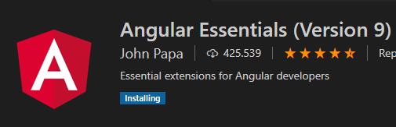

# Tips

comando útiles

```text
node -v para ver version node.js

ng version  //comprobar version angular Cli
npm i -g @angular/cli@latest //instalar angular CLI

npm start  //correr el server del proyecto
```

**Instalar  plugin en VS Code**



```text
Ejecutar serve
-------------------------------------------
ng serve 
ng serve --port 0000 // para cambiar el puerto por defecto

------------------------------------------


```


